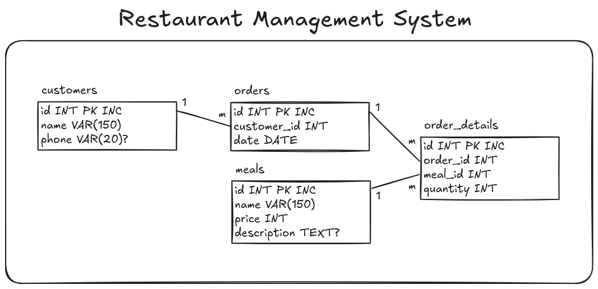

# Restaurant Management System Assignment

## Phase 1: Identifying Requirements
In this phase, I'll see the requirements for the Restaurant Management System. By looking at the [restaurant.md](https://github.com/dilovanmatini/capa-software-development/blob/main/week3/code/assignments/restaurant.md) It's clear that we essentially need 3 tables:
- Customers
- Meals
- Orders

For the **customers**, we need these details:
- Name
- Phone

and for **meals**, we need:
- Name (Meal name)
- Price
- Description (Optional)

as for **orders**:
- Customer
- Which meals
- How many each

---

## Phase 2: Schema
### tables
Now we have the requirements, We can have their tables:

**customers:**

| field | datatype     |
| ----- | ------------ |
| id    | int          |
| name  | varchar(150) |
| phone | varchar(20)  |

**meals:**

| field       | datatype     |
| ----------- | ------------ |
| id          | int          |
| name        | varchar(150) |
| price       | int          |
| description | text         |

Orders:
Here things get tricky, because each order can have many meals, and each meal can be in many orders(many-to-many relationship), we need another table, and ...:

I'll consider adding a table named order_details(or order_meal).

**order_details:**

| field    | datatype |
| -------- | -------- |
| id       | int      |
| order_id | int      |
| meal_id  | int      |
| quantity | int      |

This table allows each order to have as many meals they're being requested, and records the quantity for each meal. 

now the order table will be as following:

**orders:**

| field       | datatype |
| ----------- | -------- |
| id          | int      |
| customer_id | int      |
| date        | date     |
### Relationships
Now let's identify **relationships** between tables and their **cardinality**:

| Think                                                                                         | Decide       | Between Tables      |
| --------------------------------------------------------------------------------------------- | ------------ | ------------------- |
| - Each customer absolutely can make many orders - One order can't belong to many customers | One-to-Many  | customers -> orders |
| - Each order can have many meals - each meal can be in many orders                         | Many-to-Many | orders -> meals     |
Because Many-to-Many relationships need a bridge:

| cardinality | Between Tables          |
| ----------- | ----------------------- |
| One-to-Many | meals -> order_details  |
| One-to-Many | orders -> order_details |
### Drawing Final
Here's our final schema drown using **Excalidraw** to clear the picture:

---

## Phase 3-4: Converting schema into MySQL & writing queries
Everything's done in [restaurant.sql](restaurant.sql)

---

If need any help, consider asking in discussion section in class's actual repository:
[https://github.com/dilovanmatini/capa-software-development/discussions/categories/q-a](https://github.com/dilovanmatini/capa-software-development/discussions/categories/q-a)
